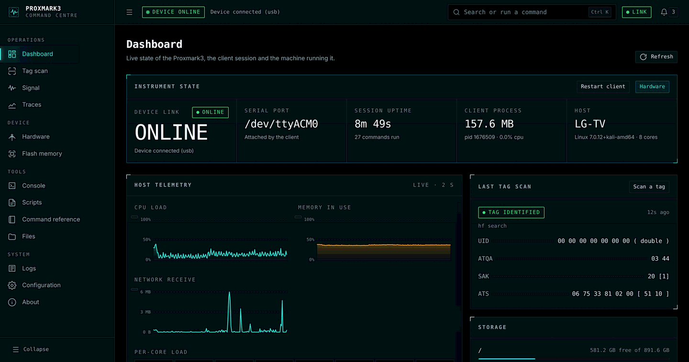
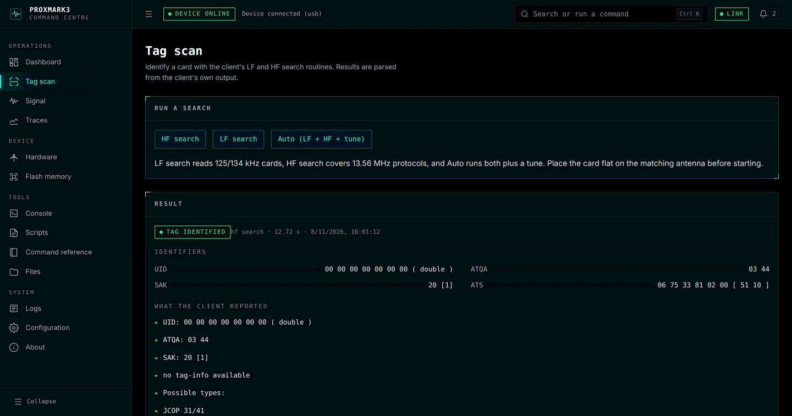
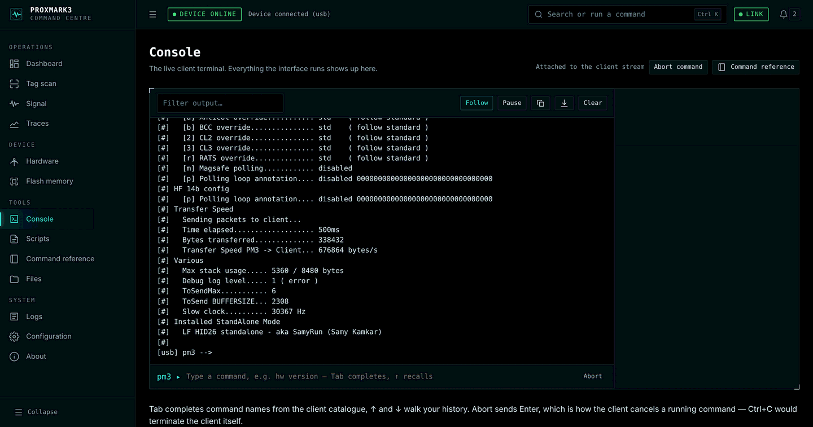
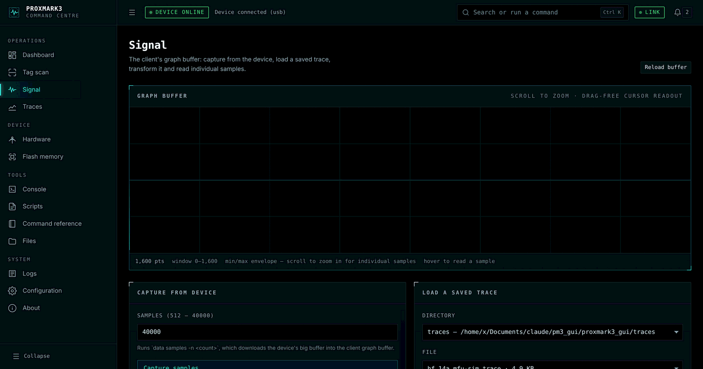
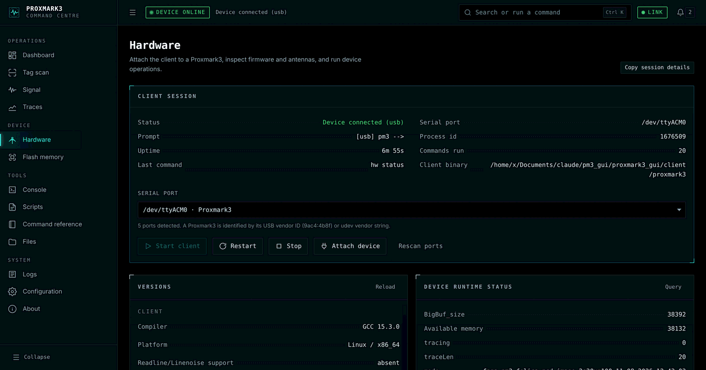
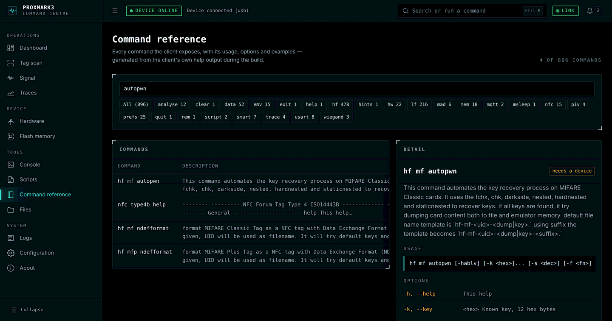

# Proxmark3 Command Centre

A web interface for the Proxmark3 client in this repository.

It does not replace the client — it drives it. A single `proxmark3 -i` process
runs behind a pseudo-terminal, and every button, chart and readout in the
interface is the result of a real client command. The same preferences file, the
same session logs, the same graph buffer. Anything the interface does, you could
have typed at the `pm3 -->` prompt.

```
   browser ──HTTP/WebSocket──▶ aiohttp server ──PTY──▶ proxmark3 -i ──USB──▶ device
```



## Quick start

```bash
# 1. Build the client (once)
make client SKIPREADLINE=1        # drop SKIPREADLINE=1 if you have libreadline-dev

# 2. Install the server dependencies
pip install -r gui/requirements.txt

# 3. Run it
./gui/pm3-gui
```

Then open <http://127.0.0.1:8788>.

The client is launched automatically and attaches to a Proxmark3 if exactly one
is detected. With no device present it starts in OFFLINE mode, which is fully
usable: trace analysis, the graph buffer, scripts, preferences and the whole
command reference all work without hardware.

### Options

| Flag | Meaning |
| --- | --- |
| `--port 8788` | listen port |
| `--host 127.0.0.1` | bind address — a non-loopback bind auto-generates an access token |
| `-p /dev/ttyACM0` | attach to a specific serial port instead of auto-detecting |
| `--offline` | start the client without connecting to any device |
| `--no-autostart` | do not launch the client; start it from the Hardware page |
| `--client PATH` | use a specific `proxmark3` binary |
| `--incognito` | client writes no history, preferences or log files |
| `--token SECRET` | require this token on every request |
| `--open` | open a browser once the server is up |

## What each page does

| Page | Backed by |
| --- | --- |
| **Dashboard** | prompt state, `hw tune`, psutil host metrics, scan history |
| **Tag scan** | `hf search`, `lf search`, `auto` |
| **Signal** | `data samples`, `data load`, `data save`, `data norm`/`autocorr`/…, `lf search -1` |
| **Traces** | `trace load`, `trace list`, `trace save` |
| **Hardware** | `hw version`, `hw status`, `hw tune`, `hw connect`, `hw reset`/`ping`/`fpgaoff`/`tia`/`dbg` |
| **Flash memory** | `mem spiffs info`/`tree`/`mount`/`check`/`remove`/`wipe`, `mem info` |
| **Console** | the raw PTY — full interactive client |
| **Scripts** | `script run`, plus a direct scan of the lua/cmd/py script directories |
| **Command reference** | `doc/commands.json`, generated during the client build |
| **Files** | the client's own directories (traces, dumps, dictionaries, resources) |
| **Logs** | `~/.proxmark3/logs/log_*.txt`, tailed live |
| **Configuration** | `prefs show` / `prefs set` |

## Screenshots

Every screenshot below is the real interface driving a real client against a
Proxmark3 on `/dev/ttyACM0` — no mockups, no placeholder data.

**Tag scan** — `hf search`, parsed into identifiers and the client's own report.



**Console** — the raw PTY. The same terminal you would get from `./pm3`, with
tab completion out of the client's command catalogue.



**Signal** — the client's graph buffer, scroll to zoom, hover to read a sample.



**Hardware** — session state, port selection, `hw version` and the device's
runtime status side by side.



**Command reference** — all 896 commands with usage, options and examples,
generated from the client's own help output at build time.



## Keyboard

| Key | Action |
| --- | --- |
| `Ctrl/Cmd K` | command palette |
| `Ctrl/Cmd /` | search everything |
| `Ctrl/Cmd B` | toggle the sidebar |
| `Ctrl/Cmd 1…9` | jump to a page |
| `R` | refresh the current page |
| `?` | shortcut list |
| `Esc` | close the palette, a dialog or the drawer |

In the palette, prefix your query with `>` to search the client's command
catalogue, or to run an exact command.

## Aborting a command

The Proxmark3 client aborts long-running commands when you press **Enter** — it
polls `kbd_enter_pressed()` and prints "Press pm3 button or \<Enter\> to abort".
`Ctrl+C` is *not* a cancel: `pm3line_install_signals()` re-raises SIGINT to the
process group, which terminates the client. The interface therefore maps its
Abort control (and `Ctrl+C` in the console) to Enter, and offers a separate
explicit "Stop client".

## Security

The server executes client commands on request, so it is built to be run by the
person sitting at the machine:

* **Loopback by default.** Binding to anything else generates a required access
  token and prints it at startup.
* **No shell, ever.** Commands go to the client's own CLI parser over a pipe.
  Newlines are rejected so a validated command cannot smuggle a second one.
* **Validated fragments.** Script names, SPIFFS filenames, trace names, serial
  ports and preference values are each constrained to their own character set
  before a command string is built.
* **Rooted file access.** File endpoints resolve symlinks *before* checking
  containment, so neither `../` nor a planted symlink escapes. Deletion is
  limited to your own `~/.proxmark3` directories.
* **Destructive actions gate.** `mem spiffs wipe`, `hw reset`, `hw bootloader`,
  SPIFFS file removal and file deletion all require an explicit confirmation
  field, and the dialog states the real consequence.
* **Strict CSP.** The page loads nothing from a third party — no CDN scripts,
  fonts or styles. Cross-origin state-changing requests are rejected.

## Tests

```bash
python3 -m pytest gui/tests -q
```

The integration tests start the real client over a PTY in offline mode. They
skip themselves with a clear reason when the binary has not been built.

## Layout

```
gui/
├── pm3-gui              launcher
├── server/
│   ├── session.py       PTY client session — the core
│   ├── api.py           REST + WebSocket routes
│   ├── app.py           aiohttp app, middleware, lifecycle
│   ├── parsers.py       client output → structured data
│   ├── catalog.py       doc/commands.json
│   ├── metrics.py       host + client process sampling
│   ├── devices.py       serial port discovery
│   ├── files.py         rooted filesystem access
│   ├── logs.py          session log reader and tailer
│   ├── scripts.py       script discovery and argument validation
│   ├── events.py        pub/sub bus
│   └── ansi.py          escape handling, severity prefixes
├── web/
│   ├── css/             design tokens, components, layout, pages
│   └── js/
│       ├── core/        dom, api, ws, store, router, notify, shortcuts, fmt
│       ├── components/  charts, terminal, palette, modal, states, icons
│       └── pages/       one module per route
└── tests/
```

## Known limitations

* Commands that prompt for interactive input mid-run are not wrapped by a page.
  Run them from the **Console**, which is a real terminal.
* Firmware flashing is deliberately not exposed. It requires the client to exit
  and re-enumerate the USB device; use `./pm3-flash-all` for that.
* `hw status`, `hw tune`, flash memory and tag scanning need a connected device.
  Without one they show an explicit "no device connected" state rather than
  placeholder numbers.
* The **Flash memory** page needs a board with an external flash chip (RDV4, or
  a build with `PLATFORM_EXTRAS=FLASH`). On a generic board the client answers
  "not available in this mode", and the page says so instead of showing an
  empty filesystem.
* Client and firmware must be built from the same revision. If they are not, the
  client refuses to communicate; the interface detects that specific failure,
  explains it and falls back to OFFLINE mode so the rest stays usable.
* Host metrics need `psutil` and port discovery needs `pyserial`. Without them
  the affected panels report the metric as unavailable instead of guessing.
* Trace and dump paths containing spaces are rejected, because the client's
  argument parser splits on whitespace.

## Support

Support the Proxmark3 Command Centre:

[](https://buymeacoffee.com/sx8yfh9zrbs)

The Proxmark3 client and firmware themselves are the work of the
[RfidResearchGroup/proxmark3](https://github.com/RfidResearchGroup/proxmark3)
project — please support them too.
